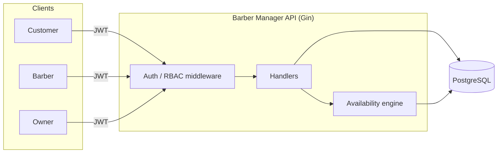
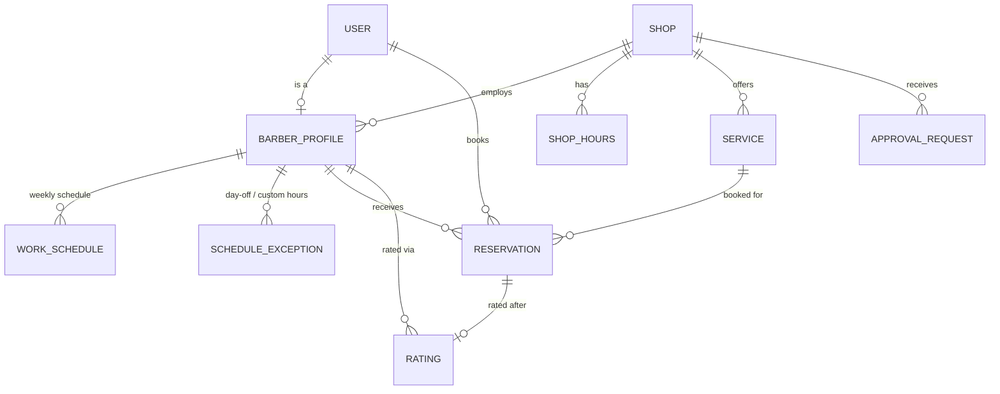

<div align="center">

# 💈 Barber Manager

**A multi-tenant REST API for barber shop management and reservations.**

Built in Go — role-based access, an owner-approval workflow for barber-proposed changes, a real availability engine, and race-safe booking enforced at the database level.

[](https://go.dev)
[](https://github.com/gin-gonic/gin)
[](https://www.postgresql.org)
[](https://www.docker.com)
[](#)

</div>

---

## What is this?

Barber Manager is the backend for a booking platform where **many independent barber shops** share one deployment. Each shop manages its own barbers, services, hours, and reservations — fully isolated from every other shop — while customers browse and book across all of them.

The interesting part isn't CRUD. It's the rules:

- Barbers don't get to silently change their schedule or prices — every change is staged as an **approval request** the shop owner has to sign off on.
- "What slots are free?" is computed live from shop hours ∩ the barber's approved schedule ∩ one-off exceptions ∩ existing bookings — not a stale cache.
- Two customers cannot double-book the same barber for overlapping times, even under concurrent requests — enforced by a Postgres `EXCLUDE` constraint, not just app-level checks.

## Highlights

| | |
|---|---|
| 🔐 **Role-based access** | Separate `customer`, `barber`, and `owner` JWTs, each scoped to their own account or shop — no cross-tenant leakage. |
| ✅ **Approval workflow** | Barber-proposed schedule/price changes land in an `ApprovalRequest` table and only apply once the owner approves them. |
| 📅 **Availability engine** | Pure, testable slot computation: shop hours ∩ approved weekly schedule ∩ exceptions − existing reservations. |
| 🔒 **Race-safe booking** | Overlapping reservations for a barber are rejected by a database `EXCLUDE` constraint — correct even under concurrent writes. |
| ⭐ **Ratings** | Customers rate a barber after a completed visit; the barber's average updates atomically with the insert. |
| 🏢 **Multi-tenant** | Every query and mutation is scoped by shop/owner/barber identity pulled from the JWT — not a hidden `WHERE tenant_id = ?` bolted on later. |

## Tech stack

<div align="center">

| Layer | Choice |
|:---|:---|
| Language | **Go 1.26** |
| HTTP framework | **[Gin](https://github.com/gin-gonic/gin)** |
| Database | **PostgreSQL** via **[pgx](https://github.com/jackc/pgx)** |
| Migrations | **[golang-migrate](https://github.com/golang-migrate/migrate)** |
| Auth | **JWT** via **[golang-jwt](https://github.com/golang-jwt/jwt)** |
| Testing | **[testify](https://github.com/stretchr/testify)** · **[gomock](https://github.com/uber-go/mock)** · **[testcontainers-go](https://github.com/testcontainers/testcontainers-go)** |
| Containerization | **Docker** / **docker compose** |

</div>

## Architecture at a glance



**Request flow for a booking:** the customer hits `POST /reservations` → the handler asks the availability engine to re-derive real open slots for that barber/day → the requested time is checked against that result → the insert itself is still protected by a DB-level exclusion constraint as the final backstop.

## Data model



## Quickstart

```bash
git clone https://github.com/zineeddinehazi/barber-manager.git
cd barber-manager/backend
cp .env.example .env
docker compose up --build
```

This starts Postgres, runs all migrations, and serves the API at `http://localhost:8080`. Then bootstrap the first shop and owner:

```bash
make seed-owner
```

`make seed-owner` walks you through creating the owner and shop interactively and prints back the IDs you'll need for owner-only endpoints.

### Local dev without Docker

```bash
cp .env.example .env    # point DATABASE_URL at your own Postgres
make migrate_up
air                      # live-reload, or: make run
```

### Testing

```bash
make test              # unit + pure-logic tests, no Postgres required
make test-integration  # spins up real Postgres via testcontainers-go
```

## Roles

| Role | How created | Can do |
|---|---|---|
| **customer** | self-registers via `POST /auth/register` | browse shops/barbers/services, book/cancel reservations, rate a barber after a completed visit |
| **barber** | created by an owner via `POST /shops/:shopId/barbers` (temp password) | edit own bio, propose schedule/price changes (owner approval required), manage own bookings |
| **owner** | created once via `make seed-owner` | manage shop info/hours, onboard barbers, create services, approve/reject barber proposals, view all shop bookings |

## API overview

Base path: `/api/v1`. JSON everywhere; protected routes require `Authorization: Bearer <token>`.

<details>
<summary><strong>Auth</strong></summary>

| Method | Path | Auth | Notes |
|---|---|---|---|
| POST | `/auth/register` | none | customer self-registration |
| POST | `/auth/login` | none | any role, returns `{token, user}` |
| PATCH | `/auth/password` | any | `{current_password, new_password}` |

</details>

<details>
<summary><strong>Public browsing</strong></summary>

| Method | Path | Notes |
|---|---|---|
| GET | `/shops?city=` | optional `city` filter |
| GET | `/shops/:shopId` | returns `{shop, hours}` |
| GET | `/shops/:shopId/barbers` | active barbers only |
| GET | `/shops/:shopId/barbers/:barberId` | includes `avg_rating`/`rating_count` |
| GET | `/shops/:shopId/services` | approved + active only |
| GET | `/shops/:shopId/barbers/:barberId/availability?serviceId=&date=` | returns `{slots: [{start, end}]}` |
| GET | `/barbers/:barberId/ratings?page=&page_size=` | paginated |

</details>

<details>
<summary><strong>Customer</strong></summary>

| Method | Path | Notes |
|---|---|---|
| POST | `/reservations` | `{barber_id, service_id, starts_at, notes}` — re-validated against live availability |
| GET | `/reservations/me` | own bookings |
| PATCH | `/reservations/:id/cancel` | only own pending/confirmed bookings |
| POST | `/reservations/:id/rating` | `{score (1-5), comment}`, only after `completed` |

</details>

<details>
<summary><strong>Barber</strong> (<code>/barbers/me/...</code>)</summary>

| Method | Path | Notes |
|---|---|---|
| GET / PATCH | `/barbers/me` | own profile / update bio |
| GET | `/barbers/me/schedule` | own **approved** weekly schedule |
| PUT | `/barbers/me/schedule` | proposes a new weekly schedule (needs approval) |
| POST | `/barbers/me/schedule/exceptions` | one-off day off / custom hours, applies immediately |
| GET | `/barbers/me/services` | own services, any status |
| PUT | `/barbers/me/services/:id` | proposes a price/duration change (needs approval) |
| GET | `/barbers/me/reservations?from=&to=` | own bookings |
| PATCH | `/barbers/me/reservations/:id/complete` | mark a booking completed |
| PATCH | `/barbers/me/reservations/:id/no-show` | mark a booking no-show |
| GET | `/barbers/me/approval-requests` | own proposals + status |

</details>

<details>
<summary><strong>Owner</strong> (<code>/shops/:shopId/...</code>)</summary>

| Method | Path | Notes |
|---|---|---|
| PUT | `/shops/:shopId` | update shop info |
| PUT | `/shops/:shopId/hours` | weekly opening hours (7 entries) |
| POST | `/shops/:shopId/barbers` | onboard a barber, returns a temp password |
| PATCH | `/shops/:shopId/barbers/:barberId/status` | activate/deactivate a barber |
| POST | `/shops/:shopId/services` | create a service, optionally scoped to one barber |
| GET | `/shops/:shopId/approval-requests` | pending proposals from this shop's barbers |
| PATCH | `/shops/:shopId/approval-requests/:requestId/approve` \| `/reject` | applies or discards the proposal |
| GET | `/shops/:shopId/reservations?barberId=&status=` | all bookings shop-wide |

</details>

## Project layout

```
backend/
├── cmd/
│   ├── api/              entrypoint, route wiring
│   └── seed/             interactive first-shop/owner bootstrap
├── internal/
│   ├── handlers/         HTTP handlers (gin)
│   ├── repository/       Postgres access, one interface + impl per aggregate
│   ├── availability/     the pure slot-computation engine
│   ├── middleware/       auth + RBAC middleware
│   └── models/           request/response and domain types
├── migrations/           golang-migrate SQL migrations
└── docker-compose.yml
```

More detail (including the full design write-up) lives in [`backend/README.md`](backend/README.md) and [`backend/PLAN.md`](backend/PLAN.md).

---

<div align="center">

Built with Go, Gin, and PostgreSQL.

</div>
